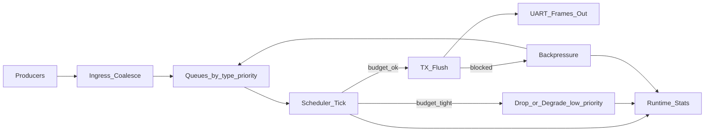

# BPU v2.9b-r1 — Data Stability Under Pressure (Flow Diagram)

This diagram illustrates the high-level runtime flow of  
**BPU (Batch Processing Unit)** and how it maintains output stability
under **TX backpressure** and **budget pressure**.

---

## Diagram intent

This diagram explains how BPU:

- Explicitly models backpressure paths
- Applies budget-based degradation
- Preserves high-priority data
- Makes all scheduling decisions observable via runtime counters

It represents **runtime behavior**, not static architecture.

---

## High-level flow

## How to read this diagram

- Every arrow represents a **runtime decision**
- Budget and TX state are evaluated on each scheduler tick
- Drops and backpressure are **explicitly counted**
- Recovery paths rejoin the main queue flow

This diagram matches:
- counters in `stats.md`
- scenarios in `log_samples.md`

- ## Diagram intent

This diagram illustrates how BPU maintains data stability
under TX backpressure and budget pressure by:

- Explicitly modeling backpressure paths
- Applying budget-based degradation
- Preserving high-priority data
- Making all decisions observable via runtime counters

